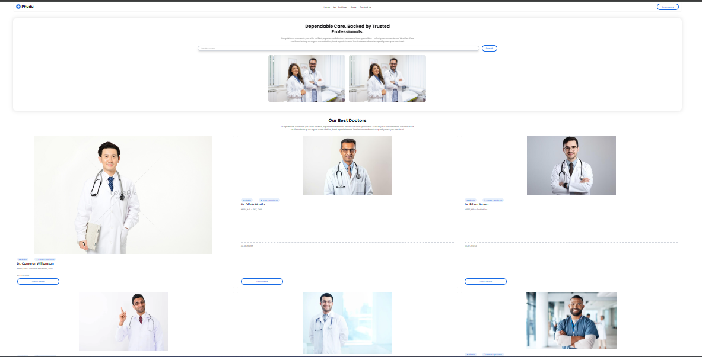

 # 📘 Doctor Appointment Website

A simple and user-friendly doctor apointment website built using react.

🔗 **Live Site:** [https://yourprojectsite.netlify.app](https://helpful-taiyaki-964f37.netlify.app/)

---

## 🚀 Technologies Used

- HTML5
- CSS3
- JavaScript
- React.js
- Tailwind CSS
- Firebase (if applicable)

---

## 📷 Screenshot



---

## ✨ Features

- User Authentication with Firebase
- Dynamic Routing
- Responsive Design
- Clean UI & Smooth UX
- API Integration

---

## 📦 Dependencies

```bash
react
react-router-dom
firebase
axios
tailwindcss


